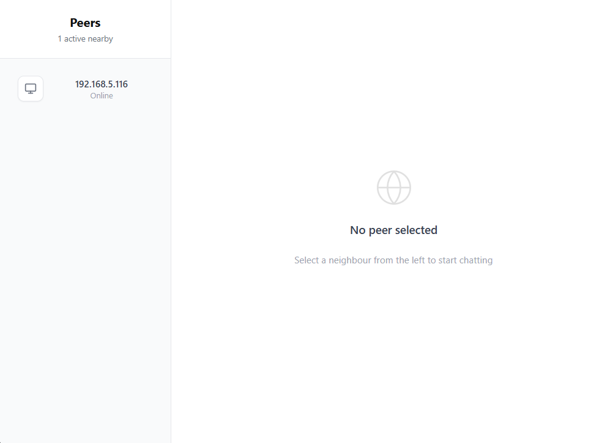
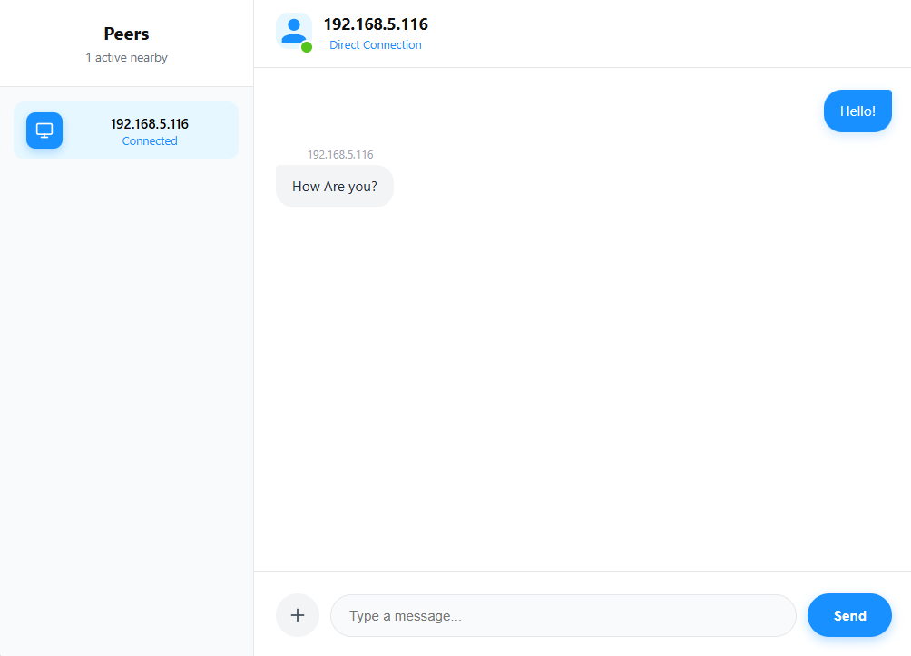
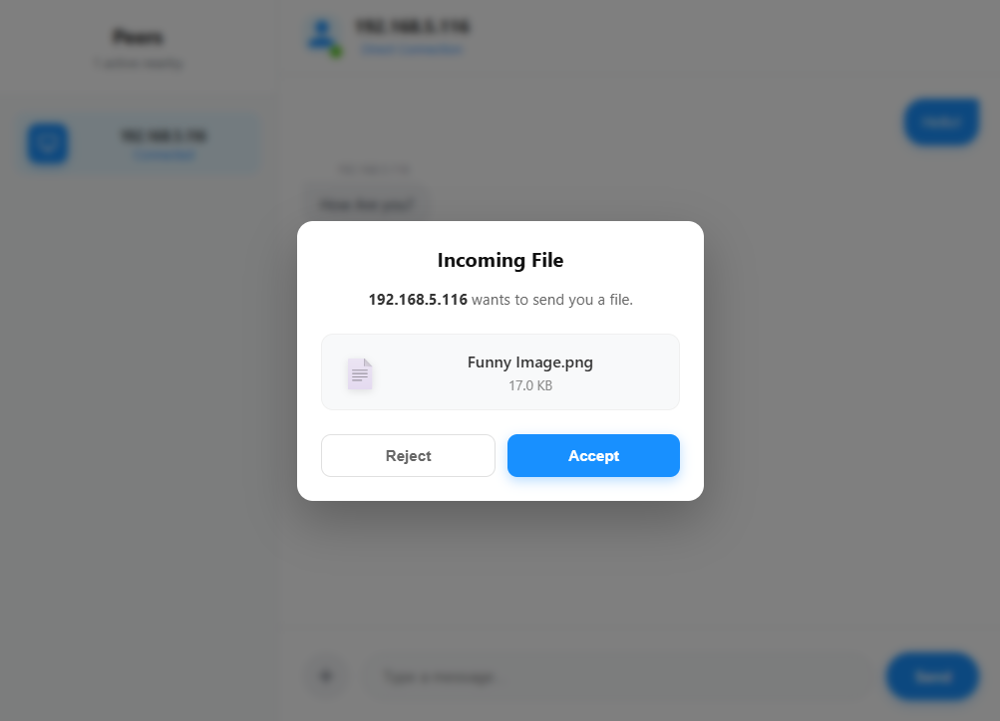

# LAN Communicator

A lightweight, peer-to-peer (P2P) messaging and file transfer tool for local area networks. Built with Go and Wails.

## Capabilities

This tool allows devices on the same Wi-Fi or Ethernet network to discover each other automatically and exchange data without needing the Internet or a central server.

* Auto-Discovery: Automatically finds other peers on the LAN using UDP broadcasting.
* Real-time Chat: Low-latency text messaging over UDP.
* File & Folder Transfer: Send large files or zipped folders directly via TCP.
* Permission Control: Users must accept file transfers before they begin.
* Cross-Platform: Runs on Windows, macOS, and Linux.

## Technology Stack

* Backend: Go (Golang)
* Frontend: HTML/JS/CSS (via Wails)
* Networking:
    * UDP (Port 3000): Peer Discovery (Broadcasts presence every 2s).
    * UDP (Port 4001): Chat Messaging.
    * UDP (Port 4002): File Offer/Response signaling.
    * TCP (Dynamic Ports): Reliable high-speed file transfer.

## Project Structure

The backend logic is modularized for clarity:

* backend/service.go: Main entry point, struct definitions, and service initialization.
* backend/discovery.go: Handles UDP broadcasting and maintaining the active peer list.
* backend/chat.go: Manages incoming and outgoing chat messages.
* backend/transfer.go: Handles file selection, zipping, offers, and TCP data streaming.

## Getting Started

### Prerequisites

* Go (v1.18+)
* Node.js (npm)
* Wails CLI

### Running in Development

1. Clone the repository.
2. Install dependencies:
   wails doctor
3. Run the app in live-reload mode:
   wails dev

### Building for Production

To create a standalone executable (no external dependencies required):

wails build

The binary will be located in the build/bin directory.

## Screenshots

### Peer Discovery & Chat

### File Transfer Request

